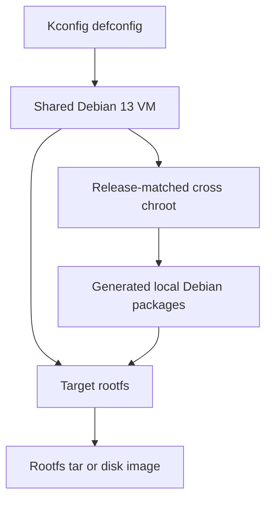

# distro-seed
## What is Distro-seed?
distro-seed is a tool to generate a Debian based distribution image for embedded targets, similar to Buildroot but using Debian packages. Right now this only targets cross platform targets like armhf/armel/arm64.

This performs a series of tasks on a debian-based rootfs to generate the image. The basic image is configured through a Kconfig system. Distro-seed provides hooks that can be used to apply overlays, execute commands in the target image, or otherwise update compile software for the target image.

Distro seed provides:
* Dependency resolution
* Debian packagelists (and further customization from the .config)
* Simple Debian package generation
* Download caching

## How Image Generation Works



distro-seed runs image generation through a small set of isolated environments instead of modifying the host system directly. The host drives the task graph, stores downloads and build artifacts, and starts a shared QEMU VM when root-level operating system work is needed.

The VM is a native x86_64 Debian installation. It is used for every target distribution and release, including Debian and Ubuntu images. This gives distro-seed one predictable place for privileged image assembly, filesystem mounting, package generation, apt caching, and other OS-level operations, while keeping those actions isolated from the developer's running system.

For target-specific builds, the VM creates a cross chroot that matches the selected target distribution and release. For example, an Ubuntu 24.04 image gets an Ubuntu 24.04 cross chroot. That chroot provides the matching cross compiler, target libraries, and headers used to build software for the target rootfs.

The target chroot is the actual root filesystem being produced. Tasks that need to configure the final image run there directly. Tasks that produce files from the host, VM, or cross chroot stage those files as generated local Debian packages, then distro-seed installs those packages into the target rootfs in task order. This keeps ownership and metadata under package-manager control instead of copying host-owned files directly into the image.

## Requirements
* x86_64 host with KVM access
* qemu-system-x86_64
* qemu-img
* xorriso
* cpio
* sha256sum
* python3
* python3-colorama
* python3-path
* python3-yaml
* python3-matplotlib
* python3-networkx

## Installing:
This will run from any x86_64 Linux distribution that supports KVM, QEMU, python3, and has a filesystem with unix permissions. KVM is required; qemu TCG fallback is not supported.

* From Ubuntu/Debian based distros:
```
apt-get update && apt-get install -y qemu-system-x86 qemu-utils xorriso cpio
```

* From Fedora/Redhat based distros:
```
dnf install qemu-system-x86 qemu-img xorriso cpio
```

On either distribution, next install distro-seed, the python requirements and check the dependencies:
```
git clone https://github.com/embeddedTS/distro-seed.git
cd distro-seed
pip3 install --user -r requirements.txt
make checkdeps # Verifies all execution requirements are met
```
## Generating a rootfs:
```
make tsimx6_debian_12_x11_defconfig
make
# The resulting image will be in work/output/
```

Besides package downloads this will typically take around 5-30 minutes on a workstation to generate an image. This generates a simple rootfs that is capable of Networking, installs the kernel from git, and runs other setup.
